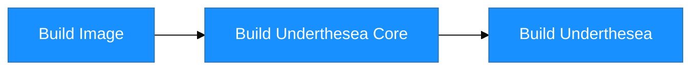

# Steps to support new python version

## Build Image

## Build Underthesea Core

## Build Underthesea

[Github Run Ons](https://docs.github.com/en/actions/using-workflows/workflow-syntax-for-github-actions#choosing-github-hosted-runners)