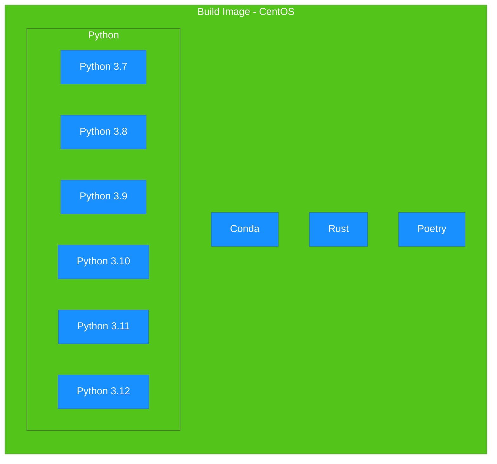

# Steps to support new python version

## Step 1: Build Image

First, create a CentOS image with Rust and Python environments. This image will be used to build Underthesea Core in Step 2.

## Step 2: Build Underthesea Core

Build the Underthesea Core using the previously created CentOS image.

## Step 3: Build Underthesea

Finally, build Underthesea.

For more details, refer to the [GitHub Actions Documentation](https://docs.github.com/en/actions/using-workflows/workflow-syntax-for-github-actions#choosing-github-hosted-runners).